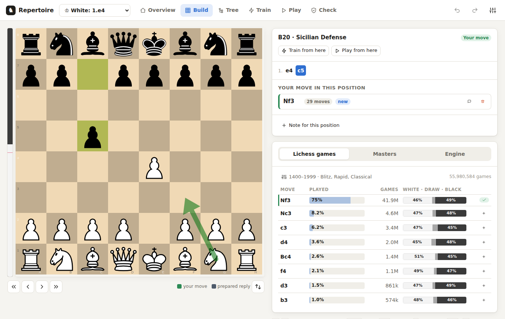
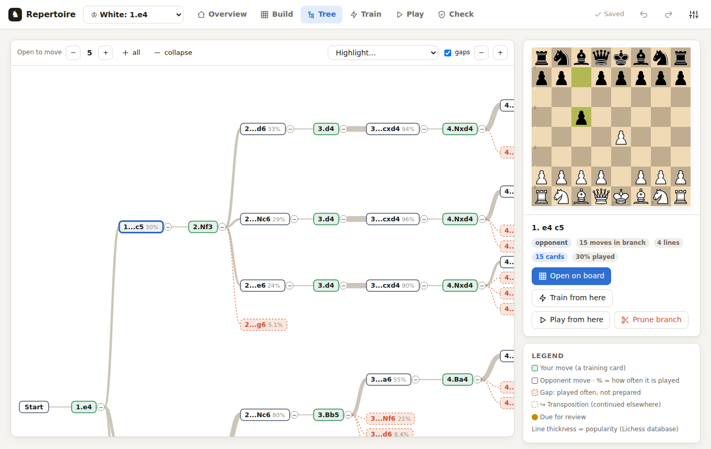
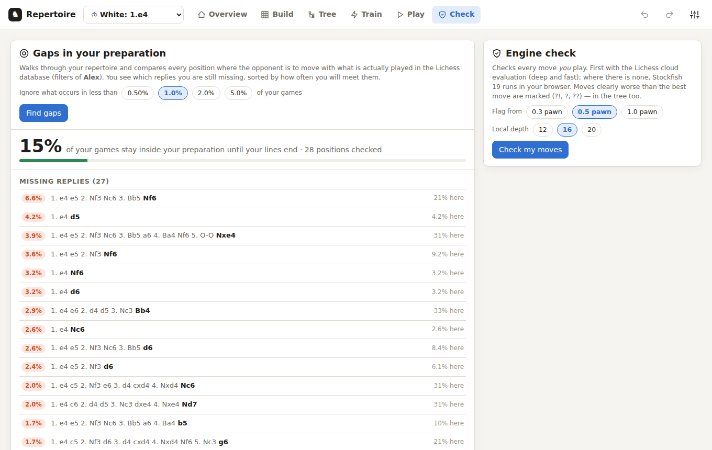
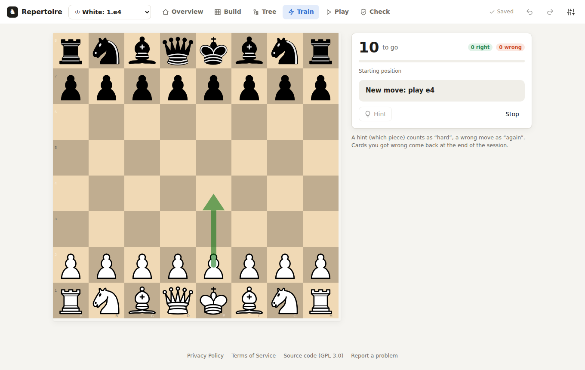
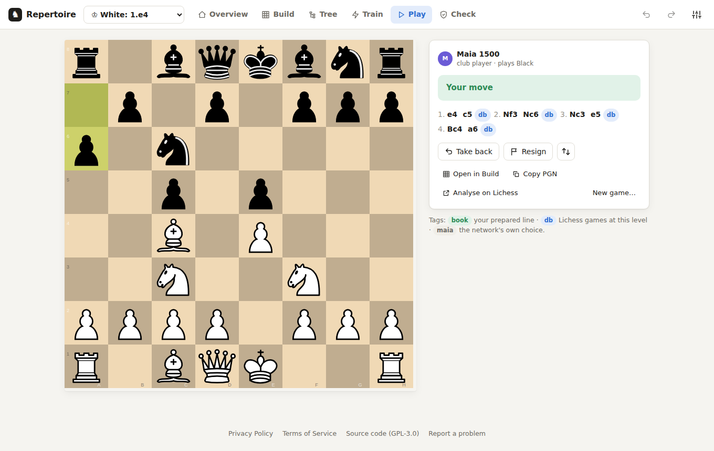

# Repertoire — build, check and train your chess openings

A web app in the spirit of Chessbook, but with **no move limit**, **several players** per device, **sync
across devices** through your own Google Drive, and a **human-like practice opponent**. Build opening
repertoires, see all branches at a glance, prune what you don't need, check your moves with an engine and
against what people at your level actually play (Lichess database), train with spaced repetition (FSRS),
and play practice games from any position. Bring in the **games you played** (Lichess or PGN): they are analysed on
your device, and the mistakes you choose become cards in your own deck of mistakes.

Live: <https://zeddyfree-art.github.io/chess/> · [About](https://zeddyfree-art.github.io/chess/#about) · [Privacy Policy](https://zeddyfree-art.github.io/chess/privacy.html) · [Terms of Service](https://zeddyfree-art.github.io/chess/terms.html)



| | |
| --- | --- |
|  |  |
| **Tree**: the whole repertoire; red dashed nodes are replies people play that you have not prepared. | **Check**: missing replies sorted by how often you will meet them, plus a coverage percentage. |
|  |  |
| **Train**: spaced repetition; every move you play is a card. | **Play**: a practice game against Maia-3; move tags show where the opponent's moves came from. |

*The screenshots use a demo repertoire and sample database percentages, not live Lichess numbers.*

## What's inside

| Screen | What you do there |
| --- | --- |
| **Overview** | The active player's repertoires with their size and what is due today. Each is marked **In play** (you play it now: your games are checked against it) or **Study** (you train it, but your games are not checked against it); click the label to switch. Drag a card by the handle at its top (═) to change the order (mouse or finger; or focus the handle and use the arrow keys); the order is saved per player and synced, and the repertoire list in the top bar follows it. Sizes are counted like books and PGN do: one **move** is White's move plus Black's reply (1.e4 e5 is one move); hover a number for the half-moves, your own moves and line lengths. Each card has **Download** (PGN), **Add lines from a PGN** (paste or file) and **Delete** (with confirmation and an Undo). |
| **Build** | Board plus the current line. Moves you play are a *proposal* (dashed blue) until you **Save** (Enter) or **Discard** (Esc). Next to it: your prepared moves in this position (○ White / ● Black, with number of follow-up moves, comments, ★ main move, delete), a note per position, and tabs **Lichess games**, **Masters** and **Engine**. **Train from here** and **Play from here** start from the position on the board. Imported comments and arrows/circles show here; you can draw your own (see below). |
| **Tree** | The whole repertoire as a diagram. Green = your move, outlined = opponent move with how often it is played; line thickness = popularity; red dashed nodes = **gaps** (played often, not prepared). Collapse/expand per branch or to a depth, highlight due / dubious / rare moves. Select a node to open it, train or play from it, or **Prune branch** (Delete) — you see beforehand how many moves and cards disappear, and everything can be undone (Ctrl+Z). |
| **Train** | Two decks: your repertoire and **My mistakes** (positions from your own games, see below). FSRS spaced repetition: each move you play is a card. New moves are shown first and quizzed again later in the session. **Practice lines** plays random lines through without affecting the schedule. Scoped to one branch when started with *Train from here* (review, drill the whole branch, or practice lines). From any card, **Open in Build** shows that position on the build board and **Analyse on Lichess** opens it on the Lichess analysis board. |
| **Play** | Practice games against **Maia-3**, a human-like neural network, at any strength from 600 to 2600. In the opening it plays what people at that level actually play (Lichess database) or sticks to your prepared lines; afterwards it plays like a human of that rating. Tells you when you (or it) leave your repertoire; take back, copy PGN, analyse on Lichess, or open the game in Build to add moves. |
| **Games** | The games you played, fetched from Lichess (period: last week, month, year or all; choose the time controls) or added from a PGN file (Chess.com, over the board). Each game is analysed on your device: an evaluation graph with the opening, middlegame and endgame, accuracy per phase, your blunders, mistakes and misses, and per mistake what was better, why, and how many players at your level would have found it. **Find a better move** lets you try again; **Train this** makes it a card; **Play from here vs Maia** plays any position of the game, or the better move, against the human-like opponent. Each game also shows where it left your repertoire. **Insights** sums up all your analysed games (see below); **Fetch new** gets the Lichess games played since the last fetch. |
| **Check** | **Find gaps**: walks your repertoire against the Lichess database (the player's rating groups and time controls) and sorts missing replies by how often you'll meet them, with a coverage percentage. The percentages are of *all* your games with that colour, like Chessbook (the shares of the opponent's moves multiplied along the line); by default replies under 2% are left out, and your choice is remembered. Transpositions count fully: a position you reach by several move orders gets the games of all of them (shown as "2 move orders"). The red boxes in the Tree and the hints in Build look at one position at a time instead (a reply played in at least 5% of the games from that position). **Engine check**: rates each of your moves (?!, ?, ??) with the Lichess cloud evaluation or local Stockfish 19. **Working through the results**: the last results of both checks stay per repertoire until you run the check again, and sync with Google Drive like the rest of your data, so you can start on the laptop and go on on the phone. Under each check it says whether the results are still up to date; once you change the repertoire (or the player's filters) it tells you, and you decide when to run it again. Running it again is quick and gives the same result as a first run: the gap search always walks the whole repertoire, but positions this device looked up in the last 30 days come from its cache, so only new ones are asked from Lichess; the engine check keeps the evaluation of every move already evaluated at least as deep (a move's evaluation depends only on its position) and evaluates only new moves, unless you tick "evaluate all again". Click one to open it in Build; a bar above the board takes you to the previous/next one and back to all results. Each item gets a ✓ as soon as your repertoire deals with it (a missing reply: the reply and your answer, ◐ with the reply only; a dubious move: replaced, or the engine's move added; a short line: extended), and "hide done" leaves only what is still open. The coverage percentage includes the replies you added since. |
| **Settings** | Players (name, own rating, colour, rating groups, time controls, Lichess username, the names you use in PGN files), Google Drive sync and backups, Lichess connection, PGN export/import per repertoire, backup file download/restore. |

Transpositions are recognised: the repertoire is a graph of *positions*, so 1.d4 Nf6 2.c4 e6 and 1.c4 e6 2.d4 Nf6
share their continuation.

## Your data and sync

**Autosave:** every change is written to your device within a moment, and immediately when you switch tab or close it.
The top bar shows *Saved* (or a warning if your browser blocks storage). With Google Drive connected, a repertoire edit
is uploaded about a second and a half later, and training progress as soon as a session ends (or you press Stop), not
card by card.


Everything is stored in the browser (IndexedDB) — no account, no server. Optionally connect **Google Drive**
(Settings → Sync & automatic backup) on each device you use:

- all devices share the same players, repertoires and training progress;
- a dated backup of your players, repertoires and training is written once a day (last 30 kept) and can be restored
  from Settings; your games are backed up once a week (last 8);
- the app uses the `drive.file` permission: it can only see the files it created itself.

Everything goes into one folder in your Drive:

```
Repertoire app/
  Sync/                     the live copies every device syncs with
    repertoire-sync.json      players, repertoires, training (including your mistake cards)
    games-sync.json           your imported games and their analysis
  Backups/
    Repertoire/             repertoire-backup-<date>.json, one a day, the last 30
    Games/                  games-backup-<date>.json, one a week, the last 8
```

Games have their own file so a large collection never slows down syncing your repertoire. The app finds its files by a
tag it puts on them, not by name or place, so renaming them does no harm. Drives set up before October 2026 (one flat
folder) are tidied into this layout by the first sync.

**Google gives browser apps one-hour sessions**, and a new one needs a tap (a website without its own server cannot
renew it silently). So when you open the app after a while, typically on a phone, it cannot fetch your latest data by
itself: a banner says *Not synced with Google Drive since …* with a **Sync now** button, and until you tap it you are
looking at this device's own copy. Local changes are kept meanwhile and go up with the next sync.

**How two devices are merged.** Each device remembers what Drive held at its last sync, so it can tell who changed what,
like a three-way merge in Git. A repertoire changed on one device only takes that version; changed on both, it is merged
move by move: lines added on either device are kept, lines pruned on either device are removed, and for a comment,
symbol, note or drawing changed on both the latest edit wins. Training progress is merged per card (the latest review
wins) and does not count as editing, so training on an old copy can never undo lines added elsewhere. Deleted players and
repertoires stay deleted.

**Keep every device on the current version.** A tab that stays open for days (typical on a phone) keeps running the version
it loaded, and an older version cannot show data that newer ones add (such as mistake cards). The app checks now and then
whether a newer version was published and then shows *A new version of the app is available* with **Reload** (your work is
saved first). Settings → Sync shows what this device holds (repertoires, mistake cards, games) and its app version, so you
can compare devices. When merging, data a version does not know is kept, never dropped.

The site owner has to create a Google OAuth client ID once: see [docs/google-drive-setup.md](docs/google-drive-setup.md).

Switching from Chessbook, Chessable or a Lichess study: export your repertoire as PGN there and choose it under
*New repertoire*. Variations, comments, arrows/circles and multiple chapters are merged.

## PGN import, comments, arrows and circles

**Adding lines to a repertoire you already have.** Use the upload icon on the repertoire's card in the Overview, *Add PGN*
in Build, or *Add PGN…* in Settings. Paste text, use *Paste from clipboard*, choose a file or drop one on the window. Before
anything is added you see what the file contains: new moves, new comments, arrows and circles, and how much is already there.
Moves you already have are kept; comments and drawings are filled in only where they are missing. If the file has a
different move of *yours* in a position where you already play something, choose **Keep both** (either counts as correct in
training) or **Keep only my move**. One **Undo** takes the whole import back. A book with hundreds of chapters (2 MB, 5,800 moves)
is read in a couple of seconds.

**Arrows and circles.** Lichess studies, Chessable and ChessBase write them into move comments as `[%cal Gc3b5,Rf4f7]` (arrows)
and `[%csl Rc7]` (circles), with the colours G/R/B/Y. The app reads them, shows them and writes them back on export:

- in **Build** on the board, and the comment of the move that led to the position is shown above the moves (that is where
  a book explains the position you are looking at); the eye button hides or shows the drawings, ✕ clears them;
- in **Tree** for the selected or hovered move, and in **Train** while a new move is being taught (not during review, so
  they do not give the answer away).

**The app's own arrows never look like annotations.** PGN only knows green, red, blue and yellow, so prepared moves are
drawn in white or black (the side that plays them) and run *under* the pieces; in a position that has annotations they are
softer still, so the author's arrows and circles stand out. The engine's best move is violet, a database move you point at
is pink. The move list uses the same ○ White / ● Black marks.

**Draw your own, like on Lichess.** Right-click and drag on the Build board for an arrow, right-click a square for a circle;
Shift or Ctrl gives red, Alt gives blue, both give yellow; drawing the same thing again removes it. Drawings belong to the
position, so they follow transpositions, are saved and synced like everything else, are undoable (Ctrl+Z) and are exported to
PGN. A click on the board never wipes them. (There is no drawing on touch screens yet; imported drawings show everywhere.)

**Annotation symbols.** The `$1`, `$14`, `!`, `?!` codes (NAGs) are kept per move and shown behind it: `e5!` for the move
rating (`!!` `!` `!?` `?!` `?` `??`), then the position rating (`+−` `±` `+/=` `=` `∞` `=/+` `∓` `−+`) and others such as `N` (novelty).
Use the `!?` button above the moves to set them yourself; they are written back on export. Unknown codes are kept as `$n`.

**Also understood.** Comments before the first move (kept as the note and drawings of the start position), arrows written as
`[%cal Ge2e4, Rd7d5]` with spaces, castling written as `0-0`, `;` comments, Lichess "From Position" games. Exports contain all
seven mandatory tags.

**What is not imported.** Chessable's setup chapters that use a pass move (`1. d4 -- 2. Nc3 --`, the opponent "does nothing") cannot
be represented in a repertoire of real games; the app tells you how many lines were cut at a pass. Clocks (`[%clk]`), engine evaluations
(`[%eval]`), Chessable's internal `[%mdl …]` codes and chess variants such as Chess960 or Atomic are ignored.

## Your games: analysis and mistake cards

**Getting them in.** *Games → Add games*. From Lichess you enter your username (public games need no login) and choose a
period and time controls; games Lichess has already analysed come with its evaluations, so they are ready sooner. A PGN file
works for any site: the app asks which player is you (it guesses the name that appears in most games) and remembers that name.

**The analysis** runs on your device, one game at a time in the background, while the app is open: about half a minute per
game on a laptop, a minute or more on a phone. It pauses while you play a practice game. You can switch tabs and use the
rest of the app meanwhile; the top bar shows how many games are left. Closing the app (or a phone locking its screen or
switching apps) pauses it, and it carries on by itself the next time you open the app: finished games are kept, at most the
game in progress starts again. On devices that allow it you can tick *Keep the screen on until it is done*.

1. Every position gets a quick Stockfish 19 evaluation (depth 14).
2. Your worst moves are looked at again, deeper (depth 18) and with the three best moves, so the verdict and the list of
   good alternatives are reliable.
3. For each mistake the engine is also asked what the opponent would play if it were their turn (a "null move"): when that
   is exactly what punished your move, you overlooked a **threat**, and the app says so ("Your opponent was threatening 32…Qxc4").
4. If Maia is downloaded (it is the Play opponent), it estimates how many players at your rating would have found a good
   move there. Mistakes most of them find are worth drilling; moves only an engine finds are shown, but not suggested as cards.

**The measures follow Lichess**, whose formulas are public: winning chances from the evaluation, a move's accuracy from the
winning chances it lost, a game's accuracy weighted towards sharp positions, and inaccuracy / mistake / blunder for a loss of
5, 10 or 15 percentage points of winning chances. Chess.com's **Miss** is added (a mistake right after your opponent's
mistake, so the chance was there and went by), and so are smaller slips that let a clearly won position go. The phases are
Lichess' too: the middlegame starts when at most ten pieces (not counting kings and pawns) are left or a back rank has
thinned out, the endgame at six.

**Mistake cards.** After the analysis the Games tab says how many mistakes could become cards; *Choose cards* lists them,
with the learnable ones ticked (and every overlooked threat). A card is the position from your game: "You played 23.e4 here.
Find a better move." Any move the engine rates as good counts: a move that is not one of the stored good moves is checked by
Stockfish on the spot, and counts when it keeps (nearly) as much. When you overlooked a threat, the card first asks what your
opponent was threatening (you play their move), and then for your answer: seeing the threat is the lesson. Each card shows
its tactical themes. **PGN** and **Copy** export the whole deck, one chapter per card with the better line and your move as
a variation, for a Lichess study (Study → Add chapter → PGN; up to 64 chapters per study) or any chess program. Cards are scheduled with FSRS like your repertoire, synced with it, and after each card you
can play the position out against Maia. One position is one card, however many games it came up in.

Games fetched from Lichess before October 2026 have no clock times; **Add clock times** in the Games list fetches them
again by their ids and adds the times (the analysis stays). For games from a PGN file, add the same file again: games you
already have get their clock times.

**Insights** (Games → Insights) puts your analysed games together, for a period (last week, month, 3 months, year, all),
time controls and colour of your choice, and always says how many games it rests on:

- score, your accuracy against your opponents', big mistakes (blunders and misses) per game, and how many clearly won
  positions (75%+ to win, about +3) you converted;
- **by phase**: your accuracy against your opponents' in the opening, middlegame and endgame, and big mistakes per 10 moves;
- **where games turned**: the phase of your biggest mistake in each game you lost (and of your opponent's in each you won);
- **your mistakes**: missed chances (after your opponent's mistake), overlooked threats and other mistakes, and whether the
  better move was a capture, a check or a quiet move, with a matching habit to work on;
- **accuracy over time**, game by game with the average of the last ten (click a game to open it);
- **openings**: score and opening accuracy per opening and colour;
- **tactical themes** of your mistakes (missed or allowed forks, pins and mates, pieces left hanging, material missed or
  lost, missed sacrifices, overlooked threats), with what to practise for the most frequent one;
- **the clock** (games with clock times, not daily games): your typical time per move and on your big mistakes, how many
  came in time trouble (under 10% of your time left), and games lost on time;
- **your repertoire in your games**: games are checked against the repertoires marked *in play*. A table compares every
  repertoire (study ones too, to see how your games would have gone with them, or to compare two versions): games it
  covers, moves followed on average, replies it has no answer to, and how often you left it. Below: the replies you have
  not prepared (with **Prepare**, which opens that position in Build, in the right repertoire), and where you left it.
  Like Chess.com's course check, but against your own repertoire.

**Limits worth knowing.** A position from the middlegame rarely comes back move for move, so a card helps through its
pattern ("the knight left the f-file, now take on f7"); read the explanation after each card. Accuracy is a noisy number for
one game; look at it over many. The evaluation in your browser is not as deep as Lichess' server analysis, so borderline
verdicts can differ by a category.

## The Lichess database

The app uses the Lichess **Opening Explorer** API (`https://explorer.lichess.org/lichess?fen=…&ratings=1600,1800&speeds=blitz,rapid`).
Ratings are groups (`0, 1000, 1200, 1400, 1600, 1800, 2000, 2200, 2500`, each up to the next), based on the average
rating of both players. **Since 2026 Lichess requires a login** for the explorer; the app does this with "Log in
with Lichess" (OAuth 2 with PKCE — you log in on lichess.org itself and the app only gets a token without extra
permissions), or you paste a personal token with no scopes. Requests are made one at a time and cached for 30 days.

Engine: first `https://lichess.org/api/cloud-eval` (deep precomputed evaluations, no login); otherwise
**Stockfish 19 (WASM)** runs locally in a Web Worker.

## The human-like opponent

[Maia-3](https://www.maiachess.com/) (CSSLab, University of Toronto) is a network trained on human games that predicts
the move a player of a given rating would make; one model covers 600–2600. The app runs it in the browser with
ONNX Runtime Web (±150 ms per move on a laptop), downloaded once (±50 MB) and cached. The board encoding was checked
against the reference implementation of the Maia platform. Move choice is sampled from the predicted probabilities
(very unlikely moves excluded), so it plays varied, human moves — including human mistakes. Inspired by Noctie, the
opening phase uses the Lichess database at the opponent's level while there are enough games, or your own prepared
lines if you choose so.

## Make it your own

We are in an era where you can shape software around your own way of studying, instead of adapting to someone else's.
This app was made that way: in plain-language conversations with [Claude Code](https://claude.com/claude-code), by someone
who does not program. So make it your own:

- **Change what doesn't fit you.** Fork the repository, open it with an AI coding assistant such as Claude Code, and
  describe what you want in your own words: a different training rhythm, other rating groups, your language, a new view.
- **Keep it open.** The app is GPL-3.0: you may change it and share it; if you share a changed version, share its source
  under the same licence.
- **Share back** what others could use, as an [issue](https://github.com/zeddyfree-art/chess/issues) or a pull request.

## Run locally

Requires [Node.js](https://nodejs.org) 22+.

```bash
npm install          # also copies Stockfish to public/
npm run fetch-maia   # optional: serve the Maia model locally (otherwise it is fetched from GitHub)
npm run dev          # open http://localhost:5173
npm test             # unit tests (repertoire graph, PGN, SRS, sync merge, Maia encoding, game analysis)
STOCKFISH=1 npx vitest run src/lib/analyzer.engine.test.ts   # the game analysis with real Stockfish (slow)
npm run build        # production build in dist/
```

## Deploy (GitHub Pages)

`.github/workflows/deploy.yml` tests and builds on every push and publishes the repository's default branch to
GitHub Pages (enable once: **Settings → Pages → Source: GitHub Actions**). Optional repository variable
`GOOGLE_CLIENT_ID` enables Drive sync (see the setup guide).

## How it's built

```
src/lib/chess.ts        chessops helpers: position keys (no move counters → transpositions), SAN/UCI, castling
src/lib/repertoire.ts   data model and pure operations: add, delete + clean up, tree, paths, stats
src/lib/srs.ts          FSRS cards (ts-fsrs), training queue in tree order
src/lib/pgn.ts          PGN import (into an existing repertoire, with comments and drawings) and export
src/lib/shapes.ts       arrows and circles as PGN tokens ("Gc3b5"), conversions to chessground and chessops
src/lib/nags.ts         annotation symbols ($1 = "!", $14 = "+/=" …): table, merging, picker logic
src/lib/lichess.ts      Opening Explorer, cloud eval, Lichess OAuth PKCE, request queue + cache
src/lib/engine.ts       Stockfish worker (UCI, MultiPV); evaluate.ts: cloud first, local fallback
src/lib/audit.ts        gap/coverage analysis and engine check
src/lib/checkResults.ts last check results per repertoire (synced), what has been done since, whether they are up to date
src/lib/maia*.ts        Maia-3: board/move encoding, ONNX worker, download + cache
src/lib/opponent.ts     practice opponent: your lines → Lichess database → Maia
src/lib/games.ts        played games: model, PGN reading (which side is you), ids against duplicates
src/lib/lichessGames.ts your games from the Lichess export API (streamed), with Lichess' own evaluations
src/lib/analysis.ts     winning chances, accuracy, phases, verdicts, moments, explanations (pure, tested)
src/lib/analyzer.ts     the analysis with Stockfish (two passes, null-move threats, Maia) and its background queue
src/lib/gamesStore.ts   games in IndexedDB, merging games of two devices
src/lib/mistakes.ts     mistake cards: from a moment, merging, training queue, PGN export
src/lib/insights.ts     the dashboard's numbers, the repertoire check of a game (pure, tested)
src/lib/themes.ts       tactical themes of a mistake from the stored engine lines (pure, tested)
src/lib/checkMove.ts    "is my move good too?": a short Stockfish check during training
src/lib/drive.ts        Google Identity Services + Drive REST (drive.file), folder layout
src/lib/sync.ts         sync loop (repertoire file and games file), backups; merge.ts: merging two devices' data
src/lib/store.ts        app state (zustand), undo/redo, IndexedDB persistence
src/components/         React screens: Build, Tree, Train, Play, Check, Games, Overview, Settings
```

## Privacy

No account, no server, no analytics: your data stays in your browser, or in your own Google Drive if you connect it.
See the [Privacy Policy](https://zeddyfree-art.github.io/chess/privacy.html) and [Terms of Service](https://zeddyfree-art.github.io/chess/terms.html) (sources: `public/privacy.html`
and `public/terms.html`). Contact and bug reports: [GitHub Issues](https://github.com/zeddyfree-art/chess/issues).

## Licence and credits

The app is free software under the [GNU GPL v3](LICENSE).


Built on [chessground](https://github.com/lichess-org/chessground) and [chessops](https://github.com/niklasf/chessops)
(Lichess), [Stockfish.js](https://github.com/nmrugg/stockfish.js), [Maia-3](https://github.com/CSSLab/maia-platform-frontend)
(CSSLab) — all GPL-3.0 — plus [ONNX Runtime Web](https://onnxruntime.ai) and [ts-fsrs](https://github.com/open-spaced-repetition/ts-fsrs) (MIT).
Because of the GPL components, the app as a whole is distributed under GPL-3.0.
